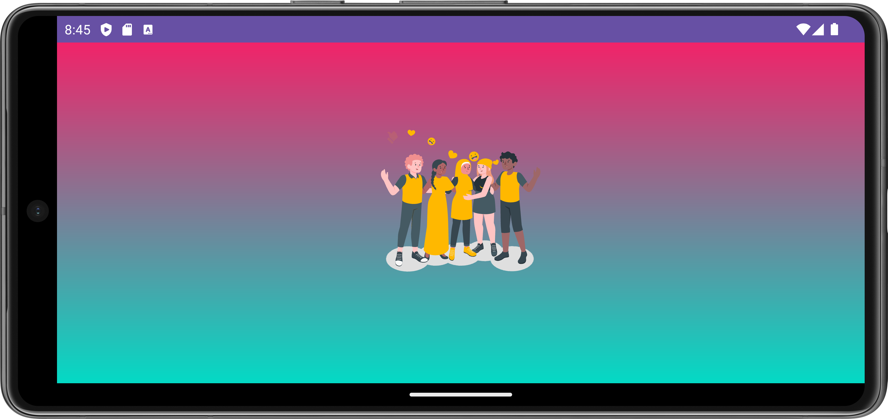
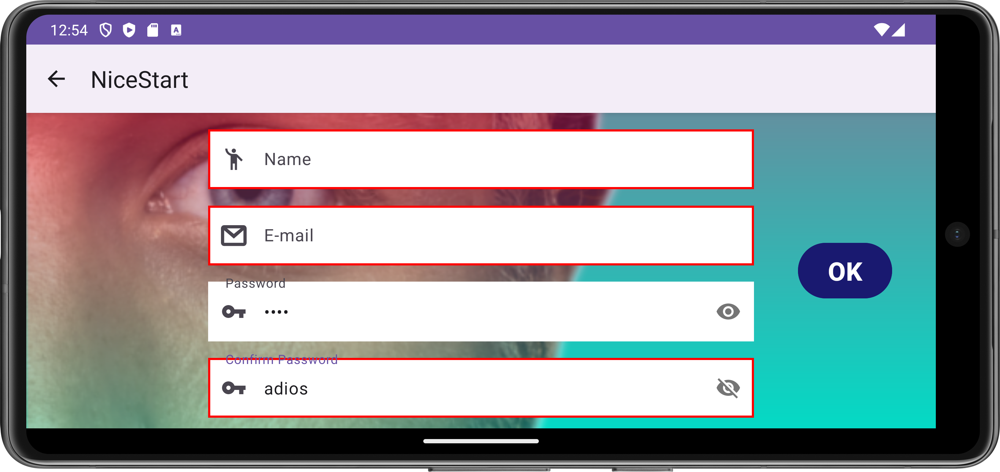
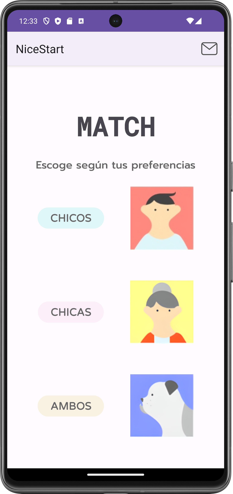
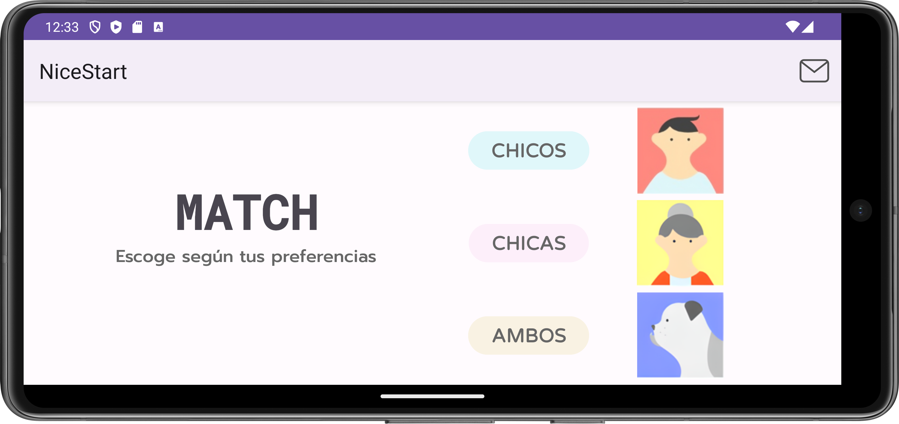
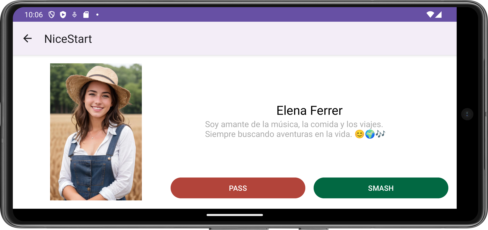

# Nicestart Project

## SPANISH
NiceStart es una aplicación Android para la autenticación de usuarios.

### Ramas
- **Login**: Contiene la funcionalidad de inicio de sesión.
- **Register**: Contiene la funcionalidad de registro.
- **Splash**: Contiene una pantalla inicial que aparece cuando se lanza la aplicación.

### Actividades
- **SplashActivity**: Aparece brevemente el logo junto con una animación.
- **LoginActivity**: Permite a los usuarios iniciar sesión.
- **RegisterActivity**: Permite a los usuarios registrarse.
- **MainActivity**: Pregunta por las preferencias del usuario.
- **TinderActivity**: Basado en las preferencias del usuario, aparecen diferentes personas.

### Capturas

### Estilo
Hemos personalizado la apariencia de la aplicación usando estilos y temas definidos en `res/values/styles.xml`. Para más detalles, por favor revisa el código y comentarios en las actividades correspondientes.

### Contribuyendo
No dudes en contribuir a este proyecto creando solicitudes de extracción o informando problemas.

## ENGLISH
This is the Nicestart project, an Android application for user authentication.

### Branches
- **Login**: Contains the login functionality.
- **Register**: Contains the registration functionality.
- **Splash**: Contains an initial screen that appears when an app is launched.

### Activities
- **SplashActivity**: The logo appears briefly along with an animation.
- **LoginActivity**: Allows users to log in.
- **RegisterActivity**: Allows users to register.
- **MainActivity**: Ask the user's preferences.
- **TinderActivity**: Based on the user's preferences, it shows different people.

### Screenshots

### Styling
We have customized the app's appearance using styles and themes defined in `res/values/styles.xml`. For more details, please check the code and comments in the corresponding activities.

### Contributing
Feel free to contribute to this project by creating pull requests or reporting issues.